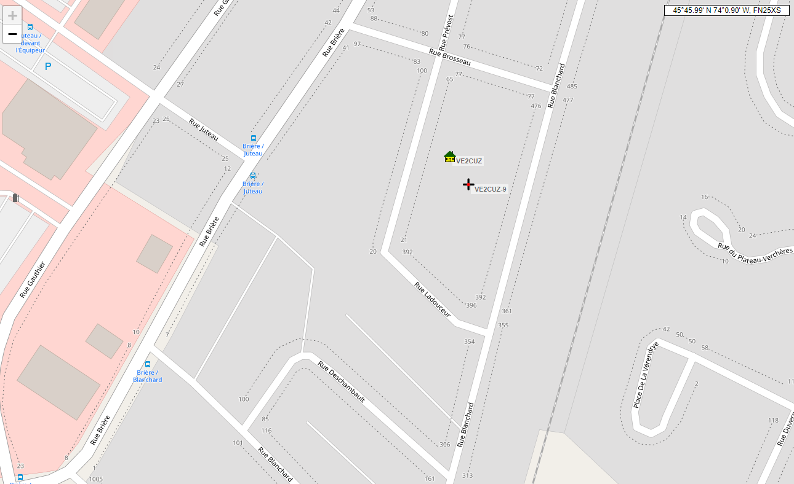
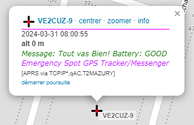
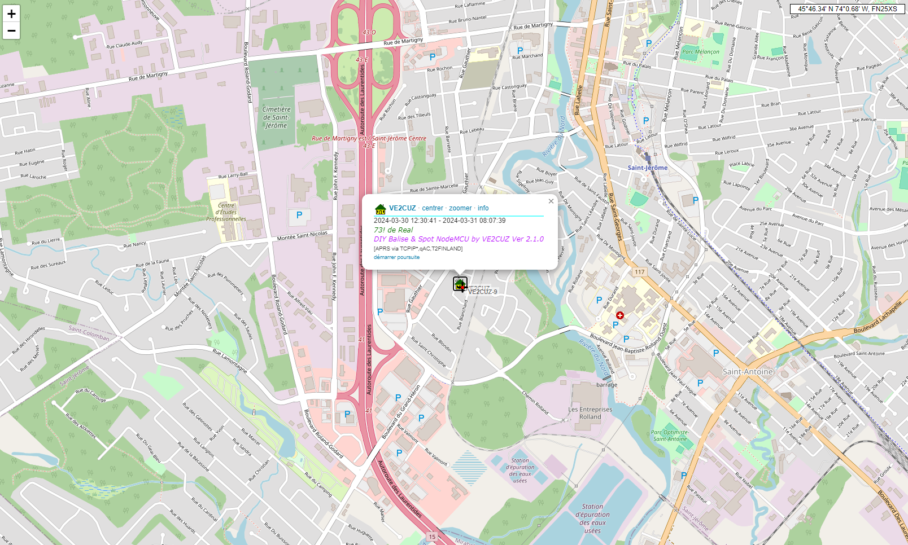

# APRS-Emergency-SPOT-Tag
ESP8266 - gateway (FindmeSpot.com API) to (APRS server (rotate.aprs2.net))

.
https://aprs.fi

.
https://aprs.fi/ve2cuz-9

.
https://aprs.fi/ve2cuz

Documentation for findmespot API link
https://www.findmespot.com/en-us/support/spot-gen4/get-help/general/spot-api-support
